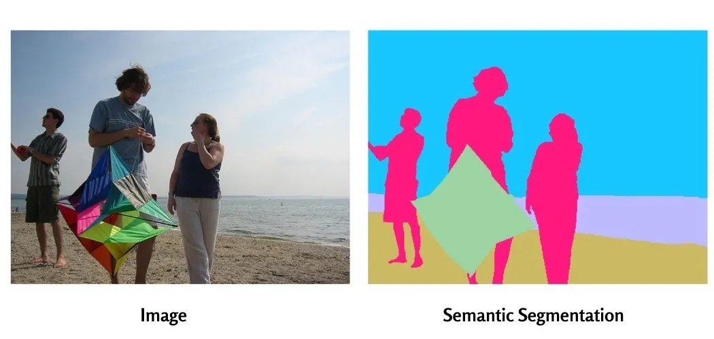

***

# Chapter 1: Prerequisites & PyTorch Basics
# 第1章：前提知識とPyTorchの基礎

## 1.1 Introduction to Computer Vision Tasks / コンピュータビジョンタスクの紹介

Before diving into semantic segmentation, we need to understand how a computer "sees" an image and where segmentation fits within the broader field of Computer Vision.

セマンティックセグメンテーションに飛び込む前に、コンピュータが画像をどのように「見る」のか、そしてセグメンテーションがコンピュータビジョンの広い分野の中でどこに位置づけられるのかを理解する必要があります。

**What is an image to a computer? / コンピュータにとって画像とは何か？**
To us, an image is a picture. To a computer, an image is just a grid of numbers (a matrix). Each number represents the intensity of a pixel. For a standard color image, there are three grids stacked together, representing Red, Green, and Blue (RGB) channels.

私たちにとって画像は絵ですが、コンピュータにとっては単なる数字のグリッド（行列）です。各数字はピクセルの強度を表します。標準的なカラー画像の場合、赤、緑、青（RGB）のチャンネルを表す3つのグリッドが重なっています。

**Comparing the Core Tasks / 主要なタスクの比較**


When analyzing an image, deep learning models usually perform one of these main tasks:
画像を分析する際、ディープラーニングモデルは通常、次のいずれかの主要なタスクを実行します。

1.  **Image Classification (画像分類):** "What is in this image?" (e.g., The model says "This is a cat"). It assigns one single label to the entire image.
    「この画像には何が写っているか？」（例：モデルが「これは猫です」と答える）。画像全体に1つのラベルを割り当てます。
2.  **Object Detection (物体検出):** "Where are the objects, and what are they?" It draws bounding boxes around objects (e.g., A box around a cat, a box around a dog).
    「物体はどこにあり、それは何か？」。物体の周りにバウンディングボックス（境界箱）を描画します。
3.  **Semantic Segmentation (セマンティックセグメンテーション):** "Which object does *every single pixel* belong to?" This is the most detailed task. It doesn't just draw a box; it highlights the exact shape of the object by classifying every pixel.
    「*すべてのピクセル*はどの物体に属しているか？」。これは最も詳細なタスクです。単に箱を描くのではなく、すべてのピクセルを分類することで、物体の正確な形状を強調表示します。

Semantic segmentation studies the uncountable stuff in an image. It analyzes each image pixel and assigns a unique class label based on the texture it represents. For example, in Figure 1, an image contains, three people, a beach, a kite and the sky. The three people represent the same texture.

Semantic segmentation would assign unique class labels to each of these textures or categories. However, semantic segmentation’s output cannot differentiate or count the two cars or three pedestrians separately.




## 1.2 PyTorch Essentials / PyTorchの必須知識

PyTorch is the framework we will use to build and train our models. Its core data structure is the **Tensor**.

PyTorchは、モデルの構築とトレーニングに使用するフレームワークです。その中核となるデータ構造は**テンソル (Tensor)** です。

**Basic Concepts of Tensors / テンソル（Tensor）の基本概念**

A Tensor is a multi-dimensional array, very similar to NumPy arrays, but with a superpower: Tensors can run on GPUs to accelerate computing.
テンソルは多次元配列であり、NumPy配列と非常によく似ていますが、大きな強みがあります。それは、GPU上で実行して計算を高速化できることです。

```python
import torch

# Create a simple 2D tensor (like a grayscale image)
# シンプルな2次元テンソル（グレースケール画像のようなもの）を作成
tensor_2d = torch.tensor([[1.0, 2.0], [3.0, 4.0]])
print("Tensor:\n", tensor_2d)
print("Shape / 形状:", tensor_2d.shape) # Output: torch.Size([2, 2])
```

**Autograd and Neural Networks / 自動微分とニューラルネットワーク**
PyTorch has a built-in engine called `autograd` that automatically calculates gradients (derivatives). This is essential for training neural networks. We use `torch.nn` to define our network layers (like convolutions).
PyTorchには、勾配（微分）を自動的に計算する `autograd` と呼ばれる組み込みエンジンがあります。これはニューラルネットワークの学習に不可欠です。ネットワークの層（畳み込みなど）を定義するには `torch.nn` を使用します。

## 1.3 Image Processing in PyTorch / PyTorchでの画像処理

To feed images into a deep learning model, we must load them and convert them into Tensors. We use `torchvision.transforms` for this.

画像をディープラーニングモデルに入力するには、画像を読み込み、テンソルに変換する必要があります。このために `torchvision.transforms` を使用します。


**Understanding Dimensions: (B, C, H, W) / 次元配列の理解: (B, C, H, W)**
In PyTorch, a batch of images is expected to have 4 dimensions:
PyTorchでは、画像のバッチは次の4つの次元を持つことが想定されています。

* **B (Batch size / バッチサイズ):** Number of images processed at once / 一度に処理される画像の数
* **C (Channels / チャンネル):** Usually 3 for RGB images / RGB画像の場合は通常3
* **H (Height / 高さ):** The height of the image in pixels / 画像の高さ（ピクセル単位）
* **W (Width / 幅):** The width of the image in pixels / 画像の幅（ピクセル単位）

**Example: Loading and Transforming / 例：読み込みと変換**

```python
from torchvision import transforms
from PIL import Image

# Define how to process the image / 画像の処理方法を定義
transform = transforms.Compose([
    transforms.Resize((256, 256)),      # Resize to 256x256 / 256x256にリサイズ
    transforms.ToTensor(),              # Convert to PyTorch Tensor / PyTorchテンソルに変換
])

# Load an image (make sure you have an 'example.jpg')
# 画像を読み込む（'example.jpg' を用意してください）
img = Image.open('example.jpg').convert('RGB')
img_tensor = transform(img)

print("Original Tensor Shape:", img_tensor.shape) 
# Output: [3, 256, 256] -> (C, H, W)

# Add a batch dimension / バッチ次元を追加
# Models expect a batch, even if it's just 1 image
# 1枚の画像であっても、モデルはバッチを想定しています
batch_tensor = img_tensor.unsqueeze(0) 
print("Batched Tensor Shape:", batch_tensor.shape) 
# Output: [1, 3, 256, 256] -> (B, C, H, W)
```

***

## References & Further Reading / 参考文献と参考資料

To help your students dive deeper, you can provide these resources:
学生がさらに深く学ぶための参考資料として、以下のリンクを提供できます。

1.  **PyTorch Official Tutorials:** "Deep Learning with PyTorch: A 60 Minute Blitz"
    * *Web:* [pytorch.org/tutorials](https://pytorch.org/tutorials/beginner/deep_learning_60min_blitz.html)
    * *Note:* The absolute best starting point for understanding Tensors and Autograd. (テンソルと自動微分を理解するための最適な出発点。)
2.  **Stanford CS231n Notes:** "Image Classification"
    * *Web:* [cs231n.github.io](https://cs231n.github.io/classification/)
    * *Note:* Excellent conceptual breakdown of how computers process pixels. (コンピュータがピクセルをどのように処理するかについての優れた概念的解説。)
3.  **Review Paper:** "A Review on Deep Learning Techniques Applied to Semantic Segmentation" (Garcia-Garcia et al., 2017)
    * *arXiv:* [arXiv:1704.06857](https://arxiv.org/abs/1704.06857)
    * *Note:* A bit advanced for day one, but good for understanding the evolution from classification to segmentation. (初日には少し高度ですが、分類からセグメンテーションへの進化を理解するのに適しています。)