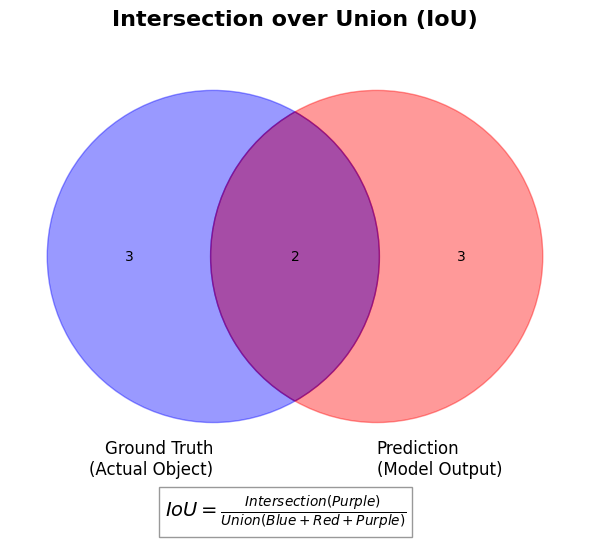

***

# Chapter 2: Core Concepts of Semantic Segmentation
# 第2章：セマンティックセグメンテーションのコア概念

## 2.1 The Core Task: Pixel-Level Classification / コアタスク：ピクセル単位の分類

While image classification assigns a single label to an entire image (e.g., "Cat"), semantic segmentation takes this a step further. The goal is to predict the class of **every single pixel** in the image. 

画像分類が画像全体に1つのラベル（例：「猫」）を割り当てるのに対し、セマンティックセグメンテーションはさらに一歩踏み込みます。その目標は、画像内の**すべてのピクセル**のクラスを予測することです。


**The Output: The Segmentation Map / 出力：セグメンテーションマップ**
The output of a semantic segmentation model is not a simple text label, nor is it an RGB image. It is a 2D matrix (a grid) of the exact same height and width as the input image. 

セマンティックセグメンテーションモデルの出力は、単純なテキストラベルでもRGB画像でもありません。それは、入力画像と全く同じ高さと幅を持つ2次元行列（グリッド）です。

Instead of color values, each pixel in this output matrix contains an integer that represents a specific class category. For example:

この出力行列の各ピクセルには、カラー値の代わりに、特定のクラスカテゴリを表す整数が含まれています。例えば：

* `0`: Background (背景)
* `1`: Person (人)
* `2`: Car (車)
* `3`: Tree (木)

Because we are assigning a class to *every* pixel independently, the model can precisely outline the shapes of complex objects.

**すべて**のピクセルに独立してクラスを割り当てるため、モデルは複雑な物体の形状を正確に縁取ることができます。

## 2.2 Evaluation Metrics / 評価指標

How do we know if our segmentation model is doing a good job? We need specific mathematical metrics to compare the model's prediction (the predicted mask) with the true answer (the ground truth mask).

セグメンテーションモデルがうまく機能しているかどうかをどのように判断するのでしょうか？モデルの予測（予測マスク）と正解（グラウンドトゥルースマスク）を比較するための具体的な数学的指標が必要です。

**1. Pixel Accuracy (PA) / ピクセル精度**

This is the simplest metric. It is simply the percentage of pixels in the image that were correctly classified.

これは最も単純な指標です。画像内の正しく分類されたピクセルの割合を単純に表したものです。

* **Problem:** It suffers from **Class Imbalance (クラス不均衡)**. If an image is 90% background and 10% car, a model that simply guesses "background" for every pixel will still get 90% accuracy, even though it completely failed to find the car.

    **問題点：クラス不均衡（Class Imbalance）**の影響を受けやすいことです。画像が90%の背景と10%の車で構成されている場合、すべてのピクセルを「背景」と推測するモデルは、車を全く見つけられなくても90%の精度を得てしまいます。

**2. Intersection over Union (IoU) / IoU（Intersection over Union）**

This is the "Gold Standard" metric for segmentation. It compares the area of overlap between the predicted mask and the ground truth mask against the total area covered by both.

これはセグメンテーションにおける「ゴールドスタンダード（標準的）」な指標です。予測マスクと正解マスクの「重なり合う面積（交差領域）」を、両者がカバーする「全体の面積（和集合）」で割って比較します。



The formula is defined as:
数式は次のように定義されます：

$IoU = \frac{\text{Area of Overlap}}{\text{Area of Union}} = \frac{TP}{TP + FP + FN}$

*(Where TP = True Positives, FP = False Positives, FN = False Negatives)*

*(TP = 真陽性、FP = 偽陽性、FN = 偽陰性)*

To evaluate the entire model, we usually calculate the IoU for each class separately and then take the average. This is called **Mean IoU (mIoU)**.

モデル全体を評価する場合、通常はクラスごとにIoUを計算し、その平均をとります。これを **Mean IoU (mIoU)** と呼びます。

```python
import matplotlib.pyplot as plt
from matplotlib.patches import Circle
from matplotlib_venn import venn2

def generate_iou_figure():
    """Generates and saves a clean IoU (Intersection over Union) diagram."""
    fig, ax = plt.subplots(figsize=(6, 6))

    # Create a Venn diagram to represent Ground Truth and Prediction
    v = venn2(subsets=(3, 3, 2), set_labels=('Ground Truth\n(Actual Object)', 'Prediction\n(Model Output)'), ax=ax)

    # Customize colors for better visibility
    v.get_patch_by_id('10').set_color('blue')      # False Negative
    v.get_patch_by_id('10').set_alpha(0.4)
    v.get_patch_by_id('01').set_color('red')       # False Positive
    v.get_patch_by_id('01').set_alpha(0.4)
    v.get_patch_by_id('11').set_color('purple')    # True Positive (Intersection)
    v.get_patch_by_id('11').set_alpha(0.7)

    # Add text annotations for the mathematical formulation
    plt.title("Intersection over Union (IoU)", fontsize=16, fontweight='bold', pad=20)
    plt.text(-0.7, -0.6, r'$IoU = \frac{Intersection (Purple)}{Union (Blue + Red + Purple)}$',
             fontsize=14, bbox=dict(facecolor='white', alpha=0.8, edgecolor='gray'))

    # 第一步：保存图片 (必须在 plt.show() 之前调用)
    plt.tight_layout()
    plt.savefig('iou_diagram.png', dpi=300, bbox_inches='tight')
    print("Saved 'iou_diagram.png' successfully in Colab storage.")

    # 第二步：直接在单元格输出显示图片
    plt.show() 

# 执行函数
generate_iou_figure()
```

## 2.3 Common Datasets / 一般的なデータセット

Training semantic segmentation models requires datasets where humans have painstakingly colored in every pixel by hand. Here are two of the most famous ones:

セマンティックセグメンテーションモデルを学習させるには、人間が手作業ですべてのピクセルを丹念に塗り分けたデータセットが必要です。ここでは最も有名な2つを紹介します。

**1. PASCAL VOC 2012**
* **Overview:** The most classic benchmark dataset. It contains everyday photos with 20 object classes (like animals, vehicles, indoor objects) plus 1 background class.

    **概要：** 最も古典的なベンチマークデータセットです。動物、乗り物、屋内の物体など、20の物体クラスと1つの背景クラスを含む日常的な写真が含まれています。

* **Why use it:** It is relatively small and manageable, making it perfect for beginners to practice training their first models.

    **使用する理由：** 比較的小規模で扱いやすいため、初心者が最初のモデルの学習を練習するのに最適です。

**2. Cityscapes**

* **Overview:** A large-scale dataset focusing on urban street scenes recorded from a car in various German cities. It contains 19 semantic classes (road, car, pedestrian, traffic sign, etc.).

    **概要：** ドイツの様々な都市で車から記録された市街地の風景に焦点を当てた大規模データセットです。19のセマンティッククラス（道路、車、歩行者、交通標識など）が含まれています。
* **Why use it:** Extremely important for research in autonomous driving (自動運転). The images are high-resolution ($1024 \times 2048$), making it more challenging to process.

    **使用する理由：** 自動運転の研究において極めて重要です。画像が高解像度 ($1024 \times 2048$) であるため、処理の難易度が上がります。

***

## References & Further Reading / 参考文献と参考資料

1.  **PASCAL VOC Dataset Paper:** Everingham, M., et al. "The pascal visual object classes (voc) challenge." *International journal of computer vision*, 2010.
    * *Web:* [host.robots.ox.ac.uk/pascal/VOC/voc2012/](http://host.robots.ox.ac.uk/pascal/VOC/voc2012/)
2.  **Cityscapes Dataset Paper:** Cordts, M., et al. "The cityscapes dataset for semantic urban scene understanding." *CVPR*, 2016.
    * *Web:* [cityscapes-dataset.com](https://www.cityscapes-dataset.com/)
3.  **Metrics Explanation:** "Evaluating image segmentation models" (Jeremy Jordan's Blog)
    * *Web:* [jeremyjordan.me/evaluating-image-segmentation-models/](https://www.jeremyjordan.me/evaluating-image-segmentation-models/)
    * *Note:* A highly recommended visual guide for students to intuitively understand IoU and Pixel Accuracy. (学生がIoUとピクセル精度を直感的に理解するための、強く推奨される視覚的ガイドです。)