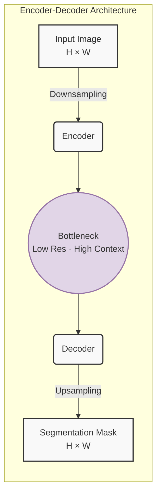

***

# Chapter 3: Network Architectures (From High-Level)
# 第3章：ネットワークアーキテクチャ（概要レベル）

## 3.1 CNN Basics Refresher / CNNの基礎のおさらい

Before we build a segmentation model, we need to quickly recall how standard Convolutional Neural Networks (CNNs) work.

セグメンテーションモデルを構築する前に、標準的な畳み込みニューラルネットワーク（CNN）がどのように機能するかを確認しておきましょう。

**How convolutions extract features / 畳み込みによる特徴抽出の仕組み**

Think of a convolution filter as a small spotlight that slides across the image, looking for one specific pattern at a time — an edge, a curve, a color gradient.

畳み込みフィルターとは、画像上をスライドしながら一度に一つのパターン（エッジ、曲線、色の勾配など）を探す小さなスポットライトのようなものです。

* **Early layers（浅い層）:** Detect simple, low-level features: edges, lines, and blobs of color.（エッジ・線・色の塊といった単純な低レベル特徴を検出します。）
* **Deeper layers（深い層）:** Combine those simple patterns to recognize complex structures, such as "a car wheel" or "a dog's ear."（それらの単純なパターンを組み合わせて、「車のホイール」や「犬の耳」といった複雑な構造を認識します。）

In image **classification**, the CNN progressively shrinks the feature map down to a single vector of numbers and outputs one final label (e.g., "Car"). For **segmentation**, however, shrinking the image all the way down is a problem — we need an output that is the *same spatial size* as the input, assigning a class label to every single pixel.

画像**分類**では、CNNは特徴マップを単一の数値ベクトルに縮小し、最終的な1つのラベル（例：「車」）を出力します。しかし**セグメンテーション**では、画像を完全に縮小してしまうことが問題となります。入力と*同じ空間サイズ*の出力が必要で、すべてのピクセルにクラスラベルを割り当てなければならないからです。

---

## 3.2 The Encoder-Decoder Structure / エンコーダ・デコーダ構造

To solve the "shrinking" problem, most modern semantic segmentation networks use a two-part architecture called the **Encoder-Decoder**.

「縮小」問題を解決するために、現代のセマンティックセグメンテーションネットワークの多くは、**エンコーダ・デコーダ**と呼ばれる2段階構成のアーキテクチャを採用しています。


*Figure 1: The Encoder-Decoder Structure*

**1. The Encoder: "What is it?" / エンコーダ：「それは何か？」**

* **Mechanism（仕組み）:** Standard CNN layers and pooling operations gradually *reduce* the spatial dimensions (height × width) while *increasing* the number of feature channels.（標準的なCNN層とプーリング演算が、特徴チャンネル数を増やしながら空間次元（高さ × 幅）を徐々に縮小します。）
* **Purpose（目的）:** It acts as a powerful feature extractor. It captures the **semantic context** of the image — understanding *what* objects are present — but in doing so, it loses the precise spatial location of those objects, because the resolution becomes very low.（強力な特徴抽出器として機能します。画像の**意味的文脈**、つまり*どんな*物体が存在するかを捉えます。ただし、その過程で解像度が低下するため、物体の正確な位置情報は失われます。）

**2. The Decoder: "Where is it?" / デコーダ：「それはどこにあるか？」**

* **Mechanism（仕組み）:** It takes the compact, semantically rich output from the bottleneck and gradually *enlarges* it back to the original image size. This process is called **upsampling** (e.g., Bilinear Interpolation or Transposed Convolution).（ボトルネックからのコンパクトで意味情報の豊富な出力を受け取り、元の画像サイズまで徐々に*拡大*します。このプロセスを**アップサンプリング**（例：双線形補間や転置畳み込み）と呼びます。）
* **Purpose（目的）:** It recovers **spatial resolution**. It maps the learned semantic features back into pixel space so the network can draw precise boundaries around every object.（**空間解像度**を復元します。学習した意味的特徴をピクセル空間に再マッピングし、各物体の周囲に正確な境界を描けるようにします。）

---

## 3.3 Classic Milestones / 代表的な古典モデル

Let's look at two revolutionary architectures that defined this field.

この分野を定義した2つの革新的なアーキテクチャを見てみましょう。

---

### 1. Fully Convolutional Networks (FCN) / 完全畳み込みネットワーク（FCN）

Before FCN, classification CNNs ended with "Fully Connected (Dense)" layers. These layers flatten the spatial information into a one-dimensional vector — great for predicting one label per image, but fundamentally incompatible with pixel-wise output.

FCN以前の分類CNNは「全結合（Dense）」層で終わっていました。これらの層は空間情報を1次元ベクトルに平坦化します。1つの画像に対して1つのラベルを予測するのには適していますが、ピクセル単位の出力とは本質的に相容れません。

```
[Classic CNN]                          [FCN]
Conv → Pool → Conv → Pool             Conv → Pool → Conv → Pool
→ Flatten → Dense → Dense             → 1×1 Conv → Upsample
→ "Cat" (one label)                   → Segmentation Map (H×W labels)
```
*Figure 2: From Classification CNN to FCN*

* **The Key Innovation（主な革新点）:** Long et al. simply *removed* the Fully Connected layers and replaced them with additional convolutions (including 1×1 convolutions) followed by an upsampling step. This allowed the network to produce a full 2D spatial map of class predictions — the first true end-to-end trainable segmentation model.（Long らは全結合層を*削除*し、追加の畳み込み層（1×1畳み込みを含む）とアップサンプリングステップに置き換えました。これにより、ネットワークはクラス予測の完全な2次元空間マップを生成できるようになりました。これが初の真のエンドツーエンドで訓練可能なセグメンテーションモデルです。）
* **Limitation（限界）:** The upsampling in FCN is relatively coarse. Because spatial detail was already heavily compressed by the encoder, the resulting segmentation masks often have blurry, imprecise boundaries.（FCNのアップサンプリングは比較的粗いものです。空間的な詳細がエンコーダによって大きく圧縮されているため、得られるセグメンテーションマスクの境界はしばしばぼやけ、精度が低くなります。）

---

### 2. U-Net / U-Net（ユーネット）

U-Net was designed to tackle FCN's blurry-boundary problem head-on. Its architecture literally looks like the letter "U" — and its central idea is elegant in its simplicity.

U-Netは、FCNの境界がぼやけるという問題に正面から取り組むために設計されました。そのアーキテクチャは文字通り「U」の字のような形をしており、その中心的なアイデアはシンプルかつエレガントです。

```
Encoder (Contracting Path)       Decoder (Expanding Path)
──────────────────────────       ──────────────────────────
[Input: 572×572]                          [Output: 388×388]
  ↓ Conv×2 → MaxPool  ──────────────────→ Upsample + Concat → Conv×2
    ↓ Conv×2 → MaxPool  ──────────────→ Upsample + Concat → Conv×2
      ↓ Conv×2 → MaxPool  ──────────→ Upsample + Concat → Conv×2
        ↓ Conv×2 → MaxPool  ──────→ Upsample + Concat → Conv×2
                 [Bottleneck: Conv×2]
                         ↑
              Skip connections ──────────────────────────────┘
```
*Figure 3: U-Net Architecture with Skip Connections*

* **The Key Innovation — Skip Connections（主な革新点：スキップ結合）:** At each resolution level, the high-resolution feature maps from the encoder are *directly concatenated* to the corresponding decoder layers. This "skips" over the bottleneck entirely for those spatial details.（各解像度レベルで、エンコーダからの高解像度特徴マップがデコーダの対応する層に*直接結合（連結）*されます。これにより、その空間的詳細に関してはボトルネックを完全に「スキップ」します。）
* **Why it works（なぜ機能するのか）:** The decoder needs two types of information: (1) *What* to draw (semantic context from the bottleneck) and (2) *Where* to draw it precisely (fine-grained spatial detail from the encoder). Skip connections supply exactly that missing location information, enabling U-Net to produce sharp, accurate segmentation masks.（デコーダには2種類の情報が必要です：①*何を*描くか（ボトルネックからの意味的文脈）と②正確に*どこに*描くか（エンコーダからの細かい空間的詳細）。スキップ結合はその欠けていた位置情報をちょうど補い、U-Netが鮮明で正確なセグメンテーションマスクを生成できるようにします。）
* **Legacy（その後の影響）:** U-Net became the go-to architecture in medical image analysis, where precise boundaries between tissues matter enormously. Its skip-connection design is now a standard ingredient in nearly all modern segmentation architectures.（U-Netは医療画像解析の定番アーキテクチャとなりました。組織間の正確な境界が非常に重要な分野だからです。そのスキップ結合の設計は、現在ほぼすべての最新セグメンテーションアーキテクチャに標準的に取り入れられています。）

---

## References & Further Reading / 参考文献と参考資料

1. **FCN Paper:** Long, J., Shelhamer, E., & Darrell, T. (2015). "Fully convolutional networks for semantic segmentation." *Proceedings of the IEEE Conference on Computer Vision and Pattern Recognition (CVPR)*.
   * *Link:* [arxiv.org/abs/1411.4038](https://arxiv.org/abs/1411.4038)

2. **U-Net Paper:** Ronneberger, O., Fischer, P., & Brox, T. (2015). "U-Net: Convolutional networks for biomedical image segmentation." *Medical Image Computing and Computer-Assisted Intervention (MICCAI)*.
   * *Link:* [arxiv.org/abs/1505.04597](https://arxiv.org/abs/1505.04597)

3. **Visual Guide:** "A Beginner's Guide to Semantic Segmentation" *(Towards Data Science)*
   * *Note:* Excellent visual walkthrough of how encoders and decoders interact step by step.（エンコーダとデコーダがどのようにステップごとに連携するかを視覚的に丁寧に解説しています。）
